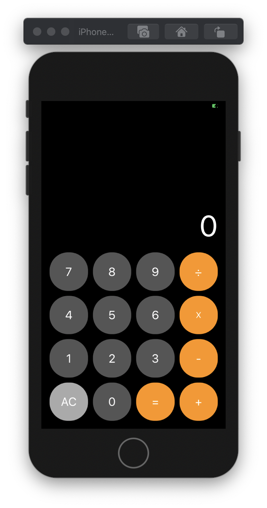
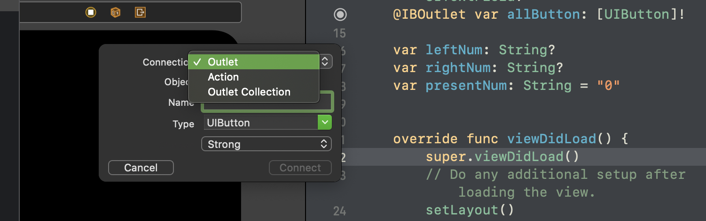

# 2차 과제 - 계산기

<p align="center">
    
</p>

1. Outlet Collection을 사용하여 한꺼번에 여러버튼 레이아웃 처리



<br/>

2. stackview로 레이아웃 맞추기

- StackView 속성
  - spacing : 5
  - alignmet : fill
  - distribution : fill eqully
- AutoLayout

  - button 하나의 속성은 너비 높이 비율 1:1
    - -> stackview 높이는 따로 설정할 필요 없이 자동 조정
  - leading, trailing, bottom 은 각각 superview 16씩
  - textField는 leading/trailing -> superview, bottom 은 stackview
    - 텍스트 길이에 따라 폰트 사이즈 자동 조정 -> Inspector에서 조정 가능

<br/>

- button layout foreach 문을 통해 처리

```swift
allButton.forEach({
    $0.layer.cornerRadius = $0.layer.frame.size.height  * 0.48
})
operatorButton.forEach({
    $0.layer.cornerRadius = $0.layer.frame.size.height  * 0.48
})
```

> 버튼의 크기에 따라 다르게 주기 위해서는 버튼 프레임의 높이에 0.5를 곱하는 경우가 많은데 0.5를하니 송편처럼나와서 살짝 값을 줄여보았다.  
> -> 좀 더 큰 사이즈에서는 약간 corner가 덜 들어간 모습이 보였다  
> 좀더 범용적인 레이아웃 적용 방법이 필요

- 버튼 눌림 효과

> 누른 연산자를 스트링 프로퍼티로 저장  
> 연산자 버튼을 눌렀을때 title과 같은 것을 selected 처리
> 그 외 연산이 취소 또는 종료 될때는 해제

```swift
func markButton(buttonTitle: String){   // parameter로 버튼 타이틀의 텍스트를 보냄
                                        // 해제할 땐 빈 스트링을 보냄
    self.operatorButton.forEach({
        if $0.titleLabel?.text == buttonTitle{
            $0.isSelected = true
            $0.backgroundColor = .white
        }else {
            $0.isSelected = false
            $0.backgroundColor = UIColor.systemOrange
        }

    })
}
```

- 그 외 계산기 로직은 코드 참조..  
 ~~생각할께 겁나많넹~~
<p align="center">
    
</p>
