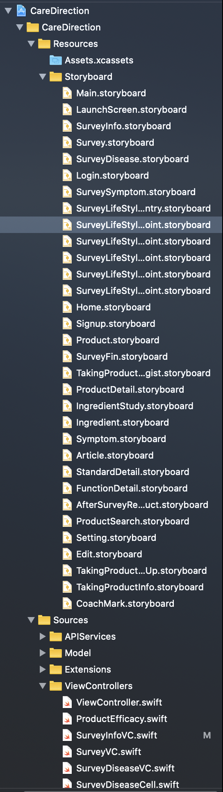
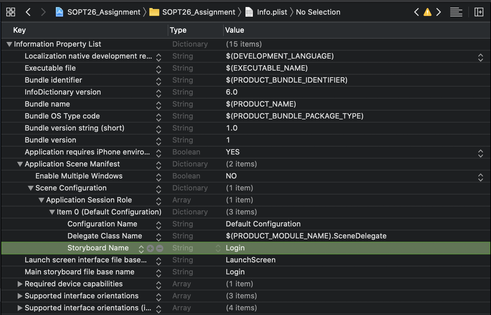
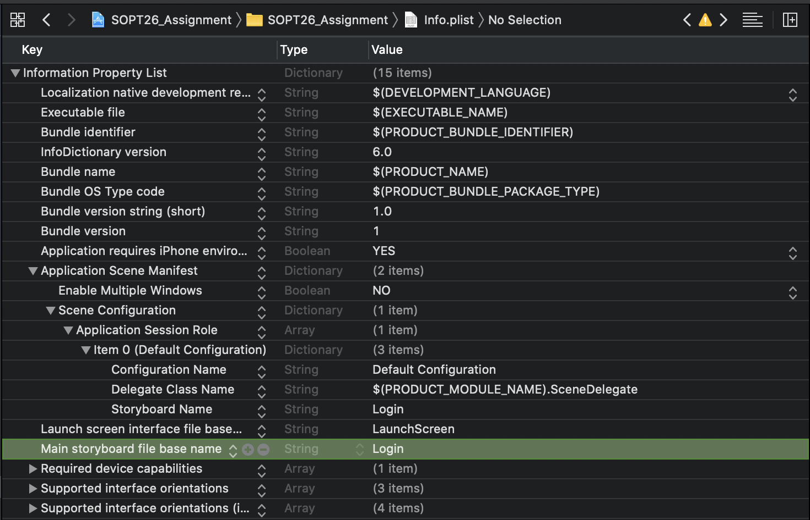
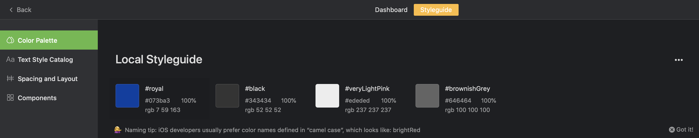
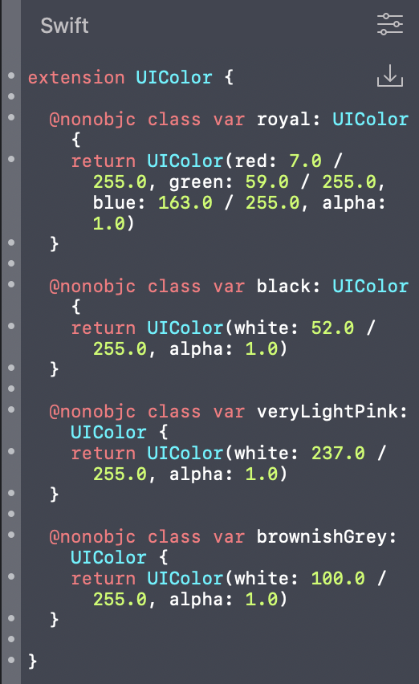
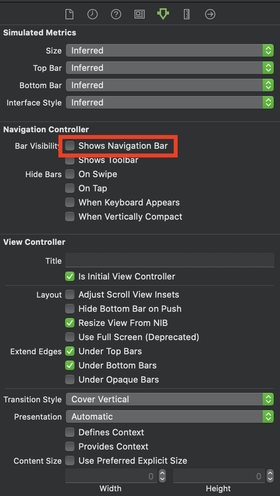

# 2차 과제 - 로그인 뷰

## 목차

- 폴더링
- 시작스토리보드 바꾸기
- 다른 스토리보드로 화면전환 하기
- Color Extension 활용하기
- 라벨을 버튼처럼 만들기
- 도전과제

## 1. 폴더링

점점 프로젝트가 커질수록 뷰컨도 많아지고 스토리보드도 많아질 것이다.. 그 외 필요한 모델이나 클래스 정의가 필요한데 프로젝트 아래에 계속 파일을 만들다 보면 나중에 찾아보기가 매우매우 힘들다..!

<p align="center">
    
    <br/>
    실제 앱젬때 파일
</p>

따라서 폴더링이 매우 중요한데 이를 위해 간단한 폴더링 예를 한번 적어보았다.

- Project
  - Resource
    - Assets.xcassets
    - Storyboard
  - Source
    - APIService
    - Model
    - Extensions
    - Cell
    - Viewcontrollers
  - SceneDelegate.swift
  - AppDelegate.swift
  - Info.plist

다음과 같이 분류를 해주어 폴더링을 해주면 찾는 보다 쉽게 파일을 찾을 수 있다.

> -단축키 꿀팁-  
> Command + shift + o 를 누르면 프로젝트 내에서 파일을 검색하고 바로 넘어갈 수가 있음

## 2. 시작 스토리보드 바꾸기

작업의 효율을 위해서 스토리보드 파일을 여러개로 나누는 것이 좋다. 하나의 스토리보드 파일에 모든 뷰를 넣어두면 스토리보드를 로드하는데 시간이 오래걸리고 같은 파일이기 때문에 나중에 협업할 때 충돌이 자주 일어 날 것이다. 충돌을 해결하다가 실수로 다른 걸 지웠을 때 오는 ....그 ... 엄청난 파장은 ...ㄷㄷ

이렇게 스토리보드를 여러개로 나눴으면 이제 시작 지점을 설정해 주어야 한다.  
Xcode에서는 따로 설정하지 않는 이상 Main 스토리보드로 시작이 되기 때문에 내가 원하는 시작 지점을 설정해 주기 위해서는 따로 설정이 필요하다.

보통 앱에대한 설정은 Info.plist에서 많이 설정할 수 있다. 이 많은 설정에서 딱 두개만 바꿔주면 된다.

<p>
    
    
</p>

Info.plist에서

- Main storyboard file base name
- Application Scene Manifest
  - Scene Configuration
    - Application Session Role
      - Item 0
        - Storyboard Name

여기 있는 이 두개의 속성에 값을 원하는 스토리보드 파일 이름으로 변경해주면 해결된다.

## 3. 다른 스토리보드로 화면전환하기

보통 뷰 전환할 때 'self.storyboard. 어쩌구 ..' 를 많이 사용한다.
근데 이거는 같은 스토리보드 파일 안에있는 다른 뷰로 넘어갈 때만 쓸수 있고 다른 스토리보드에 있는 화면으로 넘어갈 순 없다.

그래서 이제 다른 스토리보드를 참조하여야 그 스토리 보드 안에 있는 것을 사용할 수 있다.

다른 스토리보드를 참조하는 방법은

```swift
let sb = UIStoryboard.init(name: "SignUp", bundle: nil)
if let dvc = sb.instantiateViewController(identifier: "SignUpVC") as? SignUpVC {
    self.navigationController?.pushViewController(dvc, animated: true)
}
```

`UIStoryboar.init`안에 name 파라미터로 참조할 스토리보드 파일 이름을 지정하면 해당 스토리보드를 가져올 수 있고 이제 화면전환할 뷰를 지정할 때 이 스토리보드에 있는 이 뷰 컨트롤러를 사용하겠다 ! 라고 선언할 수 있다

## 4. Color Extension 활용하기

과제를 하면서 Zeplin안에 있는 색을 맞추기위해 열심히 rgb 값을 프로젝트 인스펙터 빌더 창에서 입력하거나. 또는 코드로 색을 지정해주어야 한다.

그래서 이 귀찮음을 해결하기위해 Zeplin에서는 이 색상 코드값을 바로바로 생성해 적용시킬 수 있는 방법을 제시한다. 바로 Zeplin에 Styleguide라는 탭이다.



Styleguide의 Color Palette에서는 프로젝트에서 사용되는 다양한 색상코드에 이름을 붙혀 쓸 수가 있는데 이러한 이름으로 코드까지 생성할 수 있다.

<p align=center>
    
</p>

여기서 UIColor란 Xcode 상에서 미리 정의해둔 색상(ex. System Color) 같은 색상을 사용할 때나 임의의 rgb 또는 다른 색상코드를 활용해서 색상을 만들 수 있는데,  
Zeplin에서는 Styleguide에 만들어논 색상값으로 색을 만들어 두어서 제공한다. 이는 UIColor의 Extension의 형태로 제공이 되는데 ~~extension에 대한 설명은 나중에..~~ 이를 UIColor+Extension.swift 파일을 만든 다음 위의 코드를 복붙해서 UIColor.veryLightPink 와 같이 변수명으로 색을 가져와 쓸 수 있다.

보통 앱안에서 주로 사용되는 메인컬러가 있을 것이고 이러한 색상은 엄청 많이 쓰이기 때문에 이런걸 미리 만들어 두면 색상코드를 입력하는 번거로움을 줄여준다.

## 5. 라벨을 버튼처럼 만들기

보통 사용자 클릭 이벤트를 버튼을 통해서 만드는 경우가 많은데 버튼이 들어가기 애매한 경우(ex. 이미지 또는 라벨을 클릭했을 때와 같은) 상황에서는 IBAction을 만드는 것이 불가능하다.
(불가능 한 것은 아니다.. 일종의 편법-해당하는 뷰 위에 투명한 버튼을 올리는 방법)
따라서 이러한 작업을 해주고 싶을 때는 해당하는 뷰에 사용자 인터렉션을 추가해 주는 방법이 있다.

```swift
let tapGesture: UITapGestureRecognizer = UITapGestureRecognizer(target: self, action: #selector(touchUpSignUpLabel))
self.signUpLabel.isUserInteractionEnabled = true
self.signUpLabel.addGestureRecognizer(tapGesture)
```

여기서 중요한 것은 GestureRecognizer. 간단하게 설명하자면 화면안에서 사용자의 입력을 인식하는 애 인데 이런 Gesture Recognizer는 Tap, Pan 등등.. 여러가지 세세한 사용자 인터렉션을 인식해서 selector의 매개변수로 설정한 함수를 실행시켜준다. 이러한 Gesture Recognizer를 원하는 컴포넌트에 addGestureRecognizer를 통해 등록해주면 된다. 또한 그 이전에 컴포넌트 속성의 isUserInteractionEnabled 값을 true로 주어 얘는 사용자 입력을 받을애야 !! 라고 알려 주어야 한다.

## 6. Navigation Bar 없애기

네비게이션 컨트롤러를 뷰컨에 임베드 시키면, 자동으로 네비게이션 바가 생긴다. 근데 이 네비게이션 바를 사용하고 싶지 않을 때는 스토리 보드 상에서 없애줄 수 있다.

<p align=center>
    
</p>

## 7. 도전과제

도전과제를 위해 뷰 계층을 다음과 같이 나누었다.

- 전체 뷰
  - 스크롤뷰
  - 상단 이미지를 위한 뷰

먼저 이렇게 나눈 이유는 스크롤 뷰 안에 이미지가 있으면 이미지의 크기를 줄이고 늘릴때 스크롤뷰의 크기도 변하기 때문이고 상단에 고정시켜야 하기 때문에 외부에 배치해 두고 최상위 슈퍼 뷰와 오토를 잡아두었다.

- 프로퍼티 선언

```swift
@IBOutlet var topViewHeightConstraint: NSLayoutConstraint!
// 상단 이미지의 Height Constraint
@IBOutlet var scrollView: UIScrollView!
// 우리가 사용할 스크롤뷰

var topViewInitialHeightConstraintConstant: CGFloat!
// 초기 상단 이미지의 크기를 저장할 변수
```

- viewDidload

```swift
self.scrollView.delegate = self
self.topViewInitialHeightConstraintConstant = self.topViewHeightConstraint.constant
```

여기서 delegate가 나오는데 delegate는 UIKit에서 사용자 인터렉션을 커스텀할 때 많이 쓰이는 개념이니 꼭 알아두는 것이 좋다.

간단히 설명하면 이제 해당하는 컴포넌트의 동작을 '위임한다' 라고 볼 수 있는데 그냥 얘가 할 동작중에 제어 싶은 동작을 마음대로 바꿀 수 있도록 해둔 것이다.

아무튼 이 스크롤뷰의 동작을 제어하기 위해 self.scrollView.delegate = self 라고 주면 된다. 이 Delegate를 지정해주기위해서는 UIScrollViewDelegate 프로토콜을 미리 지정해 두어야 한다.

그리고 상단 이미지의 초기 높이를 저장해 둔다.

- UISCrollViewDelegate

이제 원하는 scrollView 의 동작을 제어하기위해 스크롤뷰 delegate안에 있는 scrollViewDidScroll 함수를 커스텀해 주었다.

자세한 동작 내역은 [여기에](https://github.com/iOS-SOPT-iNNovation/Juhyeoklee/blob/master/8차%20스터디%20과제.md) ..

```swift
extension HomeVC: UIScrollViewDelegate {
    func scrollViewDidScroll(_ scrollView: UIScrollView) {
        let stretchedHeight = -scrollView.contentOffset.y

        if stretchedHeight + self.topViewInitialHeightConstraintConstant > 88 {
                self.topViewHeightConstraint.constant = self.topViewInitialHeightConstraintConstant + stretchedHeight

        }
        else {
            self.topViewHeightConstraint.constant = 88
        }
    }
}
```

먼저 scrollView의 contentOffset(스크롤뷰에서 보여지는 현재 위치의 y좌표의 -를 붙힌다.
스크롤뷰 최상위에서 드래그를 하면 contentOffset의 y 좌표는 - 값이 나오기 때문에 원하는 만큼 상단이미지의 높이를 늘리고 줄이기 위해서 contentOffset의 부호만을 바꾸어 주었고 이 값을 초기 상단 이미지의 높이 값과 더해준 값을 상단 이미지뷰의 높이로 지정했다.

또, 아래로 내렸을 때 최소 높이가 존재하기 때문에 그 이하로 줄어 들시에는 최소높이로 지정했다.
최소 높이는 [여기에](https://kapeli.com/cheat_sheets/iOS_Design.docset/Contents/Resources/Documents/index) 있는 iPhone 6.1인치 모델의 Navigation bar height 의 값을 따랐다.

<p align=center>
    
</p>
