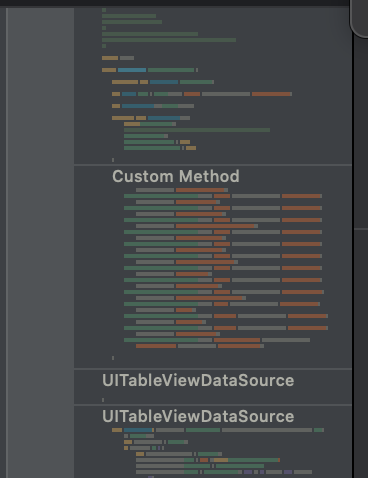
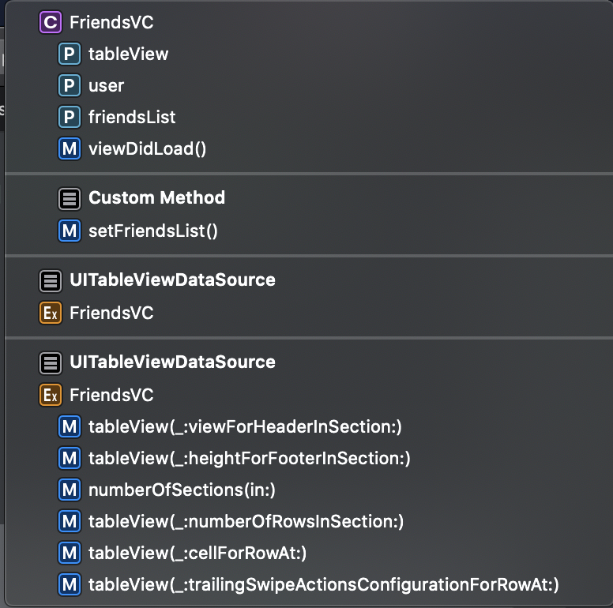
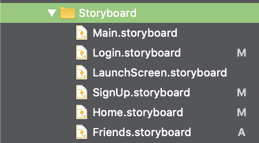
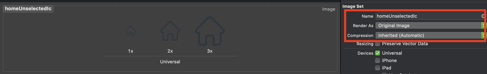
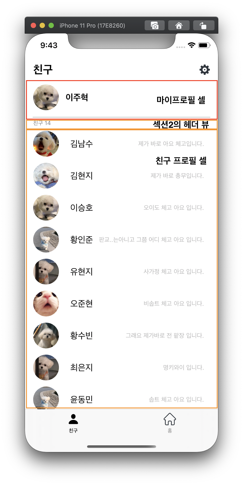

# 3차 과제 - 친구 리스트

## 목차

- Tip: MARK 주석 달기
- TabBar 코드로 잇기
- 헤더뷰 설정하기
- 도전과제 - Table View Row 지우기

## Tip: MARK 주석 달기

레퍼런스 코드들을 자주 들여다 보면 이제 주석에 MARK라는게 달려 있는 경우를 보았을 텐데  
이 MARK가 뭐하는 녀석인지 간단하게 말하자면 말 그대로 이 부분에 내가 표시해 놓겠다 ! 인데 도대체 어디다 표시를 한다는건지, 잘 못봤을 것이다. 이 마크는 Xcode 상에서 우측이나 상단에 있는 코드 맵? 같은곳에 표시를 해줘서 좀더 정돈된 느낌으로 코드를 볼 수 있다.

<p align="center">
    
    
</p>

뷰에 이것저것 기능들을 넣다보면 코드가 길어져서 이곳저곳 옯겨다닐 때 불편한데 이렇게 정리를 해두면 찾기도 쉽고 빠르게 옯겨 볼 수 있다 !!

## 1. Tab Bar 코드로 잇기

스토리보드를 마구마구 나누어 놓았더니 이런 탭바를 이어야 하는 상황이다..!

<p align="center">
    
    <br/>
    각각 하나의 스토리보드만 있다., 너무 잘게 나누는 것도 별로인것 같기두 ..
</p>

> 원래는 Story Board Reference 라는 것으로 불러올 순 있지만 .. 이게 질 인되서 .. 그냥 코드로 한번 이어보았다 !

1. Custom Tab Bar Controller 생성  
   빈 탭바컨트롤러를 스토리보드 상에서 생성하고, 코코아 터치 파일로 커스텀 탭바 컨트롤러를 생성한다. 그리고 이제 로그인-회원가입 화면에서 도착지점으로 이 탭바 컨트롤러를 지정해 주면 탭바와 연결 성공 !

```swift
if let dvc = self.storyboard?.instantiateViewController(identifier: "TabBarC") as? TabBarC {
        self.present(dvc, animated: true)
}
```

2. Tab Bar Controller 내부 설정
   이제 TabBarC의 내부를 구성해주어야 한다.

UITab Bar Controller에서 할 수 있는건 각 탭에서 보여줄 뷰컨트롤러를 결정하고, 각 탭의 이미지와 텍스트까지 결정해 줄 수 있다.

또한 눌러져 있는 상태와 아닐때의 각 탭이 어떻게 보여자는지 도 결정해 줄 수 있다.

각 탭의 설정은

```swift
// 첫번째 탭의 설정
let FriendsStoryboard = UIStoryboard.init(name: "Friends", bundle: nil)
guard let firstTab = FriendsStoryboard.instantiateViewController(identifier: "FriendsVC")
    as? FriendsVC  else {
    return
}

firstTab.tabBarItem.title = "친구"
// - 탭의 제목 설정
firstTab.tabBarItem.image = UIImage.init(systemName: "person")
// - 탭의 이미지 설정
firstTab.tabBarItem.selectedImage = UIImage.init(systemName: "person.fill")
// - 탭이 눌려져 있을 때의 이미지 설정
```

이렇게 설정한 두 가지의 탭을 탭바안에 속하는 뷰컨트롤러로 설정한다.

```swift
// Create an Array of Tables with Tabs as Elements.
let tabs =  [firstTab, secondTab]
// Set the ViewController.
self.setViewControllers(tabs, animated: false)
// Do any additional setup after loading the view.
```

다음은 전체 코드

```swift
class TabBarC: UITabBarController {

    override func viewDidLoad() {
        super.viewDidLoad()
        setTabBar()
        self.tabBar.tintColor = UIColor.black
    }


    func setTabBar(){
        // 첫번째 탭의 설정
        let FriendsStoryboard = UIStoryboard.init(name: "Friends", bundle: nil)
        guard let firstTab = FriendsStoryboard.instantiateViewController(identifier: "FriendsVC")
            as? FriendsVC  else {
            return
        }

        firstTab.tabBarItem.title = "친구"
        firstTab.tabBarItem.image = UIImage.init(systemName: "person")
        firstTab.tabBarItem.selectedImage = UIImage.init(systemName: "person.fill")


        // Second Tap init
        let HomeStoryboard = UIStoryboard.init(name: "Home", bundle: nil)
        guard let secondTab = HomeStoryboard.instantiateViewController(identifier: "HomeVC")
            as? HomeVC  else {
            return
        }
        secondTab.tabBarItem.title = "홈"
        secondTab.tabBarItem.image = UIImage(named: "homeUnselectedIc")
        secondTab.tabBarItem.selectedImage = UIImage(named: "homeSelectedIc")


        // Create an Array of Tables with Tabs as Elements.
        let tabs =  [firstTab, secondTab]
        // Set the ViewController.
        self.setViewControllers(tabs, animated: false)
        // Do any additional setup after loading the view.

    }

}
```

> 이게 각 탭 이미지를 상태에 따라 변경해 줄 수 있지만, 탭바의 Tint Color를 바꿔서 색상만을 따로 지정할 수 있다.  
> 이미지가 탭바의 틴트 컬러의 영향을 받고 싶지 않다면, 에셋에서 다음 속성을 Original image 로 바꿔주면 Tint Color의 영향을 받지 않는다.

<p align="center">
    
    <br/>
</p>

2. 헤더 뷰 잇기

먼저 테이블뷰의 구조를 다음과 같이 잡고 작업하였다.

<p align="center" >
    
    <br/>
</p>

> 헤더뷰는 대충 테이블의 목차라 할 수 있겠다.

그리고 섹션의 갯수와 각 섹션에서 행의 갯수를 다르게 주었다.

```swift
func numberOfSections(in tableView: UITableView) -> Int {
    return 2
}

func tableView(_ tableView: UITableView, numberOfRowsInSection section: Int) -> Int {
    switch section {
    case 0:
        return 1
    case 1:
        return self.friendsList.count
    default:
        return 0
    }
}
```

그 다음 각 섹션에 맞게 셀을 만들었다.

```swift

func tableView(_ tableView: UITableView, cellForRowAt indexPath: IndexPath) -> UITableViewCell {

    switch indexPath.section {
    case 0:
        if let cell = self.tableView.dequeueReusableCell(withIdentifier: MyProfileCell.identifier) as? MyProfileCell {
            cell.setLayout(user: self.user)

            return cell
        }
    case 1:
        if let cell = self.tableView.dequeueReusableCell(withIdentifier: FriendProfileCell.identifier) as? FriendProfileCell {
            cell.setLayout(friend: self.friendsList[indexPath.row])

            return cell
        }
    default:
        return UITableViewCell()
    }
    return UITableViewCell()
}
```

이제 친구 리스트 섹션(1번섹션)의 헤더에 뷰를 추가해 줄 것이다.  
헤더뷰의 생성은 tableView Delegate 안에 있는 viewForHeaderInSection에서 추가해 주었다. 간단한 라벨만 추가하면 되는 거기 때문에 코드로 작성하고 섹션이 1일때 헤더뷰를 설정하고 아닌경우 빈 UIView를 리턴하도록 하였다.

> 코드로 뷰 만드는게 안해버릇 하니까 잘 기억이 안난당 .. 잘 기억안나서 [승호가 한 것](https://github.com/26th-SOPT-iOS/LeeSeungHo/blob/master/Links/3rdSeminarAssignment.md)참고하였다.

```swift
func tableView(_ tableView: UITableView, viewForHeaderInSection section: Int) -> UIView? {
    let headerView = UIView()
    if section == 1 {
        let friendCountLabel = UILabel()
        friendCountLabel.text = "친구 \(self.friendsList.count)"
        friendCountLabel.textColor = UIColor.brownGrey
        friendCountLabel.frame = CGRect.init(x: 15, y: 0, width: 35, height: 17)
        friendCountLabel.font = UIFont.systemFont(ofSize: 11)
        headerView.addSubview(friendCountLabel)

        friendCountLabel.translatesAutoresizingMaskIntoConstraints = false
        let constraintX = NSLayoutConstraint.init(item: friendCountLabel,
                                                    attribute: .leading,
                                                    relatedBy: .equal,
                                                    toItem: headerView,
                                                    attribute: .leading,
                                                    multiplier: 1.0,
                                                    constant: 16)
        let constraintY = NSLayoutConstraint.init(item: friendCountLabel,
                                                    attribute: .centerY,
                                                    relatedBy: .equal,
                                                    toItem: headerView,
                                                    attribute: .centerY,
                                                    multiplier: 1.0,
                                                    constant: 0)

        NSLayoutConstraint.activate([constraintX, constraintY])
    }

    return headerView
}

그리고 각 섹션마다 이제 footer라는 것도 존재하는데 footer의 크기를 0 으로 고정시켜 주었다.
~~~swift
func tableView(_ tableView: UITableView, heightForFooterInSection section: Int) -> CGFloat {
    return 0
}
~~~

```

3. 도전과제 - 셀 지우기

이거는 한번도 안해봐가지고 어떻게 할까 고민했는데 [남수의 자료](https://github.com/26th-SOPT-iOS/KimNamSoo#3차과제)에 좋은 레퍼런스 가 있어서 참고 하였다.

별로 내가 한건 없고 거의 그대로 코드를 가져다 붙혔더니 바로 되었다...! 나중에 안의 세부 동작에 대해 좀 자세하게 봐바야 겠다.

```swift
func tableView(_ tableView: UITableView, trailingSwipeActionsConfigurationForRowAt indexPath: IndexPath) -> UISwipeActionsConfiguration? {

    if indexPath.section == 1 {
        let deleteAction = UIContextualAction(style: .destructive, title: "안녕..") { (action, view, success ) in
            self.friendsList.remove(at: indexPath.row)
            self.tableView.reloadData()

        }
        let config = UISwipeActionsConfiguration(actions: [deleteAction])
        config.performsFirstActionWithFullSwipe = false
        return config
    }
    else {
        return UISwipeActionsConfiguration()
    }
}
```

내가 해준건 이제 섹션 1에서만 지우기 이벤트를 할 수 있도록 해주고, 데이터가 변경됨에 따라 `self.tableView.reload()`를 호출해서 테이블뷰가 현제 데이터에 맞게 갱신하도록 하였다.


